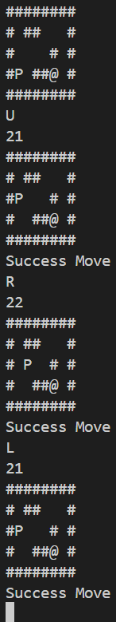

# AsciiMazeDart

 
Ini merupakan program untuk menjalankan ascii maze. Project ini dibuat untuk memenuhi salah satu tugas mata kuliah Pemrograman Berbasis Website. 
Dokumen penjelasan: <a>https://docs.google.com/document/d/1flceOkTEuPI82S9jGI6fBkvnIxhUgkSzWQU0iVHOXHc/edit?tab=t.0</a>
 
Video coding: <a>https://youtu.be/lB1-IoVjMTs</a>
 
